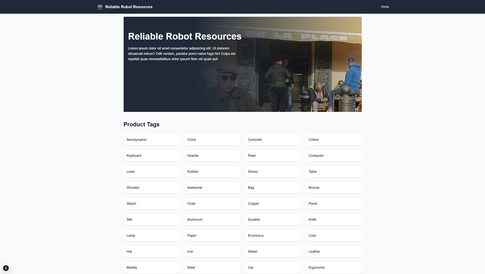
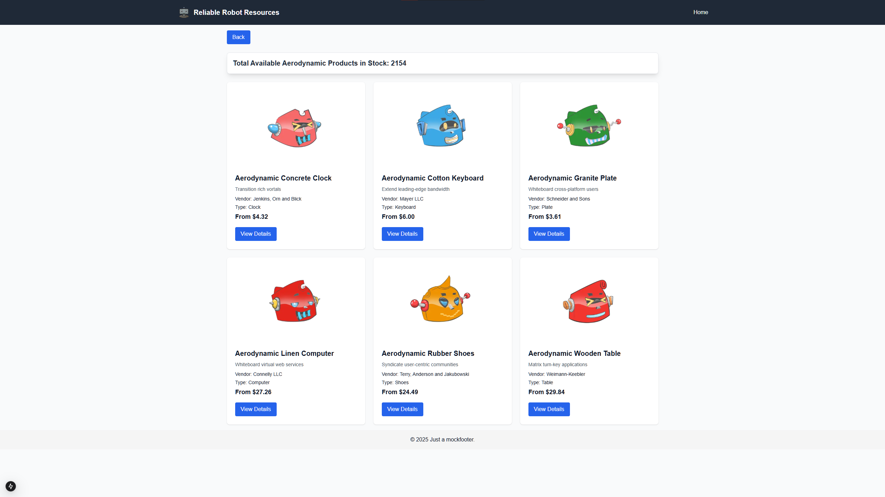
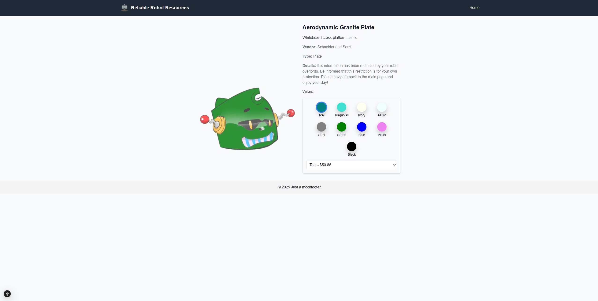

# Reliable Robot Store 🤖

## Table of Contents
- [Overview 📋](#overview-)
- [Tech Stack 💻](#tech-stack-)
- [Installation 🔧](#installation-)
- [Usage 🚀](#usage-)
- [Screenshots 📸](#screenshots-)
- [DevOps & CI/CD Pipeline 🛠️](#devops--cicd-pipeline-)
- [Acknowledgments 🌟](#acknowledgments-)

---

## Overview 📋

Reliable Robot Store is designed to mimic a robot storefront for people who need an efficient, mobile-friendly way to browse their new bot friends by tags. The app features:

---

## Tech Stack 💻

- Next.js 13 with Server and Client Components ⚡
- TypeScript 📝
- Shopify Products REST API 🛍️
- Tailwind CSS for styling 💨
- ESLint/Prettier for code quality ✅

---

## Installation 🔧

Clone the Repository:

```bash
git clone https://github.com/maurograndaoramos/Reliable-Robot-Store.git
cd reliable-robot-store
```

Install Dependencies:

```bash
npm install
# or
yarn install
```

Configure Environment Variables:

Create a `.env.local` file in the root directory with the following content:

```env
SHOPIFY_BASE_URL=your_shopify_base_url
SHOPIFY_ACCESS_TOKEN=your_shopify_access_token
```

Run the Development Server:

```bash
npm run dev
# or
yarn dev
```

---

## Usage 🚀

Visit the App: Open [http://localhost:3000](http://localhost:3000) in your browser 🌐.

Browse Tags: Start on the Tags List Page to view all product tags 🏷️.

Filter Products: Click on any tag to navigate to the Products List Page and see products with that tag 🛒.

View Details: Click on a product to see its detailed view with variant selection and more 🔍.

---

## Screenshots 📸

(Don't forget to add your screenshots to the screenshots folder in your repo.)

- **Tags List Page 📋:**

- **Products List Page 🛒:**

- **Product Detail Page 🔍:**

---

## DevOps & CI/CD Pipeline 🛠️


- **Linting & Code Quality ✅:** Automatically check your code with ESLint/Prettier via GitHub Actions.
- **Automated Testing & Builds 🚀:** Ensure every commit is tested and built correctly before deployment.
- **Deployment Pipeline 🌐:** Easily extend the pipeline to deploy your app to your favorite cloud provider.

---

## License 📄

This project is licensed under the MIT License. See the LICENSE file for details.

---